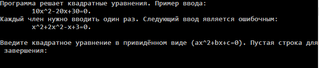

# QuadraticEquation
Программа, решающая квадратные уравнения.
1. [Использование](#использование)
2. [Компиляция](#компиляция)

### Использование
* Открыть папку `Release` и запустить файл `QuadraticEquation.exe`.
* Открывается консоль.

    

* Уравнение должно вводиться в приведённом виде `ax^2 + bx + c = 0`.
* Если ввести уравнение не в приведённом виде, программа проигнорирует первые слагаемые квадратичного члена. Например, если ввести `x^2 + 3x^2 + x + 20 = 0`, то `x^2` будет проигнорированно.

### Компиляция
Проект небольшой, комплиция не составит большого труда :) (все файлы исходного кода находятся в папке `src`)